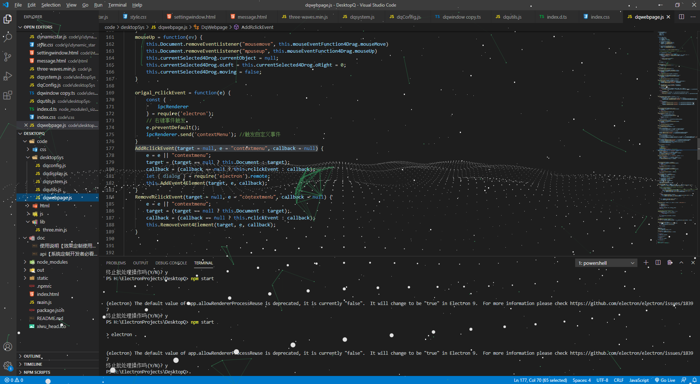
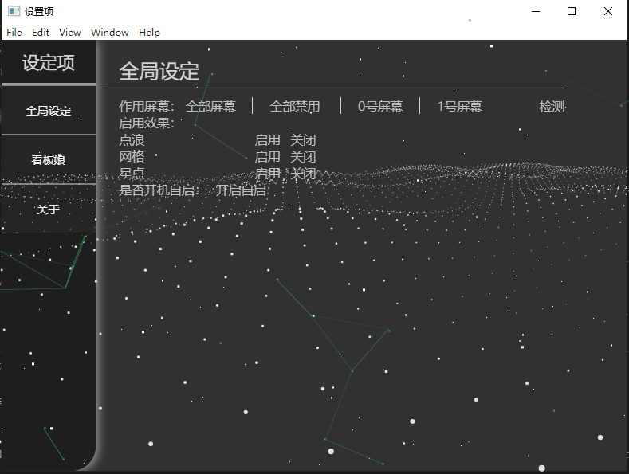
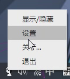

## DesktopQv0_1.0

A desktop beautification and desk pet software running on electron.

一个基于electron的桌面美化软件和桌宠软件，目前只开发了预想内容的冰山一角。

**开发目标：**

- 能够直接兼容网页上已有的网页效果
- 利用3D或Live2d制作桌宠，并且给桌宠增加更为细致的功能对应。
  - 或许以后可以直接载入其他人开发的基于web的桌宠？然后调用API实现更为细致的交互，比如聊天、定时闹钟、随机互动...？

**代码涉及内容：**【可以作为开发参考？】

主线程和渲染线程通信、多屏控制、托盘【tray】、开机自启、配置内容保存。

**预览：**

有三种效果在画面中，可以分别设置。

设置面板。

托盘。

以上版本为DesktopQv0_1版本。
